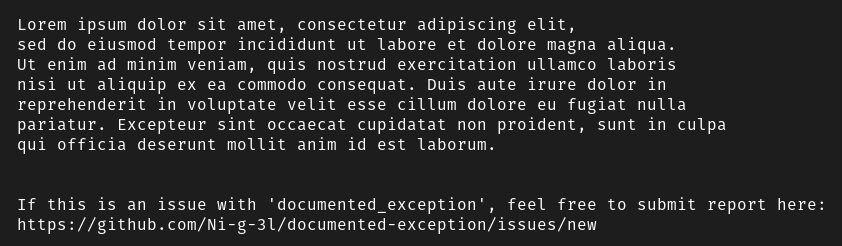

# Documented Exception

Provide exception message from docstring.



## 📥 Installation

1. Download latest version from [Release](https://github.com/Ni-g-3l/documented-exception/releases)
2. Run ```pip install <path_to_wheel>```

## 🕹️ Use

1. Install **documented_exception** into your env
2. Add your root __init__.py file

```python

from documented_exception import BaseDocumentedException

BaseDocumentedException.PACKAGE_NAME = <your_package_name>
BaseDocumentedException.PACKAGE_URL = <your_package_url>
BaseDocumentedException.HEADER = <your header message>

```

## 🖥️ Test

1. Clone repository
2. Go into folder
3. Run ```python -m unittest discover tests/```

## 🤹 Authors / Contributers / Attributions

* **Ni-g-3l** - *Main Developer* - [Github](https://github.com/Ni-g-3l/)

See also the list of [contributors](https://github.com/Ni-g-3l/documented-exception/contributors) who participated in this project.

## 📃 License

This project is licensed under the MIT License - see the [LICENSE](LICENSE) file for details.

## 👏 Acknowledgments

* **Billie Thompson** - *README & Contribution Templates* - [PurpleBooth](https://github.com/PurpleBooth)